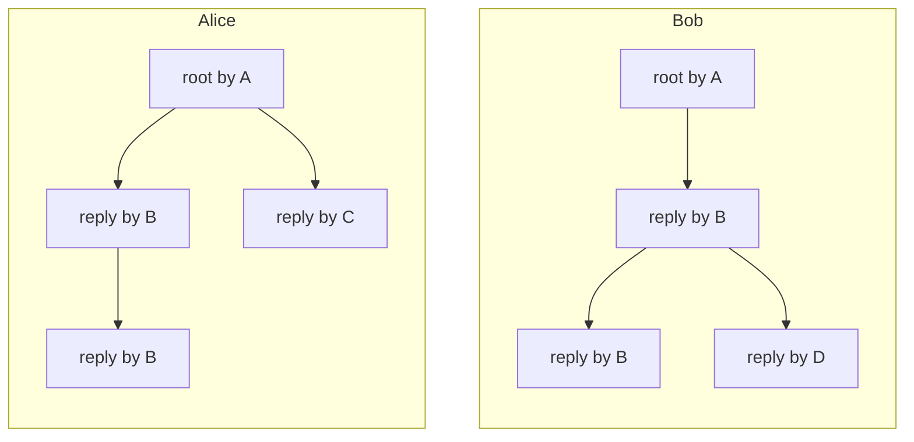
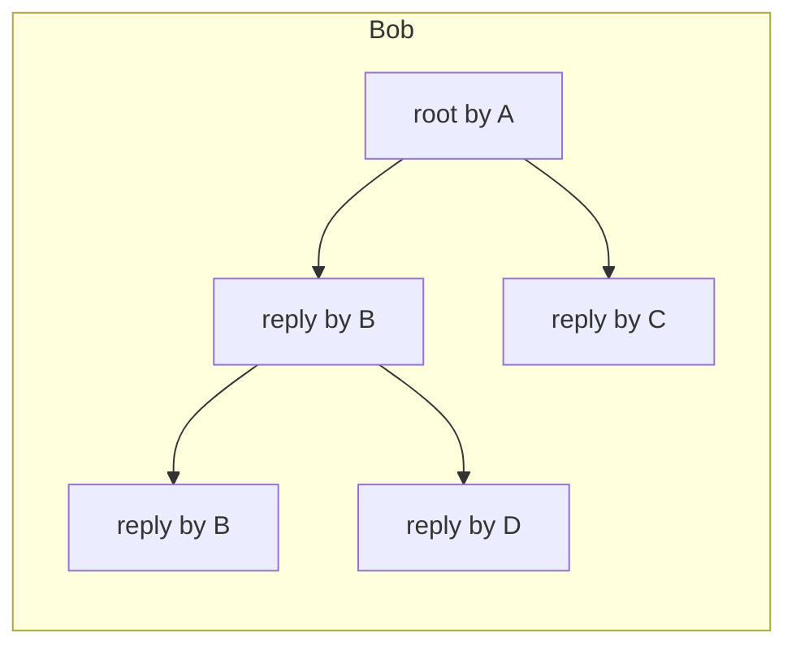
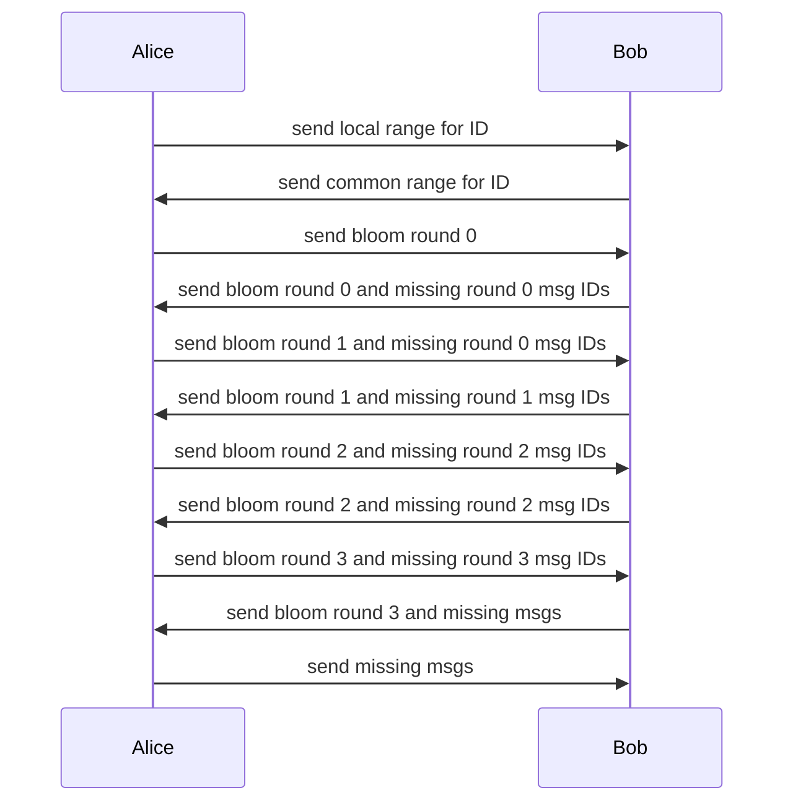

**Work in progress**

BEFORE dagsync:

```mermaid
graph TB;
  subgraph Bob
    direction TB
    rootAb[root by A]
    replyB1b[reply by B]
    replyB2b[reply by B]
    replyD1b[reply by D]
    rootAb-->replyB1b-->replyB2b & replyD1b
  end
  subgraph Alice
    direction TB
    rootAa[root by A]
    replyB1a[reply by B]
    replyB2a[reply by B]
    replyC1a[reply by C]
    rootAa-->replyB1a-->replyB2a
    rootAa-->replyC1a
  end
```

AFTER dagsync:

```mermaid
graph TB;
  subgraph Bob
    direction TB
    rootA[root by A]
    replyB1[reply by B]
    replyB2[reply by B]
    replyC1[reply by C]
    replyD1[reply by D]
    rootA-->replyB1-->replyB2 & replyD1
    rootA-->replyC1
  end
```

## DAG sync protocol

```mermaid
sequenceDiagram
  participant A as Alice
  participant B as Bob
  A->>B: send local range for ID
  B->>A: send common range for ID
  A->>B: send bloom round 0
  B->>A: send bloom round 0 and missing round 0 msg IDs
  A->>B: send bloom round 1 and missing round 0 msg IDs
  B->>A: send bloom round 1 and missing round 1 msg IDs
  A->>B: send bloom round 2 and missing round 2 msg IDs
  B->>A: send bloom round 2 and missing round 2 msg IDs
  A->>B: send bloom round 3 and missing round 3 msg IDs
  B->>A: send bloom round 3 and missing msgs
  A->>B: send missing msgs
```